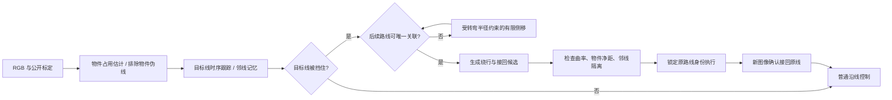

# 避障 v2：0920 近距平行干扰地图修复

本次处理的是用户保存的 **0920挑战·近距平行干扰(1)**，文件 ID 为 `656d6ca8f53b4de59df9283a652ba4fd`。输入快照见 [user-close-obstacles.json](../artifacts/algorithms/avoidance-v2/scenes/user-close-obstacles.json)。它在上方返回弯道 `(3.1, 2.2)` 和下方路段 `(4.5, -0.5)` 各放置一个交通锥。原地图、障碍物位置、车辆模型和评分规则均保留。

## 原版为什么停住

v1 并没有漏掉第一个交通锥。MPC 在约第 260 帧已经检测到物件，但拒绝规划，随后停在约 `(5.08, 2.83)`；日志显示「占道物件后方目标路线尚未确认，制动等待」。PP 和 MPC 的合法进度分别停在约 28.1%、27.7%。

原来的流程是：RGB 彩色物件检测 → 地面占用估计 → 判断是否挡住目标线 → 必要时侧移看后方 → 规划绕行曲线 → 接回原线。失败来自几个环节叠加：

1. **侧移模板只适用于接近直线的入射方向。** 这里刚出弯道，可见路线明显偏向车头一侧，候选被拒绝；原地停车又无法改善遮挡。
2. **把立体物件边缘当作地面线。** 交通锥黑底座、条纹边缘进入道路骨架。向地面投影后，这些伪线会扭曲切向或生成错误的后续路线。
3. **遮挡关联范围没有覆盖侧移后的相机盲区。** 旧版只允许跨越约一个物件宽度的缺口。侧移后，即使能看到切向一致的原路线，近处盲区仍可能使间隔超过这个限制。
4. **接回模板默认从线中心出发。** 车已经侧移时，这个假设不成立；需要从当前偏移和车头方向重新规划。短暂关联失败还可能提前清空原路线记忆。

因此，单纯降低障碍物净距或允许选择最近的另一条线，并不能修复这个问题。

## 现在的流程



没有安全候选、侧移预算耗尽或无法确认路线身份时仍会制动。

- 障碍物检测只使用 RGB；先排除检测到的立体物件图像区域，再提取地面道路骨架，避免用底座边缘估计路线方向。
- 分别保存目标线和其他可见线。重新进入视野的地面区域会刷新记忆，清除不再受到当前图像支持的旧投影；近处盲区中的邻线记忆继续保留。
- 侧移使用与车头、干净路线切向相接的 Bézier 曲线。正常关联仍使用紧的遮挡间隔；侧移期间搜索范围最多扩展到 2.5 m，并要求续段切向一致、横向误差小且候选唯一。这个范围是局部视觉关联约束，不是已知地图信息。
- 绕行候选考虑已有横向偏移；已经侧移到物件旁边时，增加从当前车头方向出发的接回曲线。两类候选共用曲率、障碍物净距和邻线隔离检查。
- 短暂续段关联失败会保留已验证的侧移和原路线身份。只有新图像中的路线与原记忆吻合，并且车辆实际回到线附近后，才退出绕行状态；预测线本身不能确认接回。

侧移和绕行巡航分别为 0.25、0.38 m/s，惯性制动继续由原车辆模型执行。物件感知、规划对 PP 与 MPC 共用，底层控制器仍是两个独立入口。`temporal_pursuit_avoidance`、`temporal_mpc_avoidance` 升为 **2.0**；原有不避障方法保持独立。

## 验证与边界

完整结果见 [results.json](../artifacts/algorithms/avoidance-v2/results.json)。使用原 640×360 图像、1500 帧上限和评分器 4.0；成功包含结束后的实际惯性制动检查。对照保留失败案例，不修改地图或成功阈值。

| 本次用户地图 | v1 | v2 |
|---|---|---|
| PP + 避障 | 停车超时，28.1% | 成功，99.5%，无碰撞或非法换线 |
| MPC + 避障 | 停车超时，27.7% | 成功，99.5%，无碰撞或非法换线 |

六张开发图 × 两种方法的成功回合从 **6/12 增加到 8/12**；此前能通过的三张图均继续通过。具体逐图结果见 [对照表](../artifacts/algorithms/avoidance-v2/results.md)。用户原图另经真实 JSONL Worker 验证，两种方法均完整成功，结果见 [protocol](../artifacts/algorithms/avoidance-v2/protocol)。全量测试 **204 项通过**，Ruff 检查通过；当前源文件摘要与最终评测计划一致。

冻结策略后额外运行了左右镜像、种子 10029 的同源地图：PP 成功，MPC 在第二次绕行接回阶段停车，合法进度 72.7%，共 **1/2**。这是保留的额外失败，说明当前版本仍受观测和接回路径误差影响，不能称为复杂地图上稳定避障。

本轮属于对已知失败地图的修复。六张开发地图中包含本次用户图以及此前的五张障碍回归图，不能当作未知地图泛化保证。连续占道和旧 0920 的紧邻障碍布局仍可能因后续路线不可确认或空间不足以生成当前候选而停车。灰色、低对比、与起点标记同色的物件也仍在这套颜色感知基线的能力边界之外。

复现当前版本：

```bash
python scripts/evaluate_algorithms.py \
  --algorithms temporal_pursuit_avoidance temporal_mpc_avoidance \
  --scene-files artifacts/algorithms/avoidance-v2/scenes/user-close-obstacles.json \
                artifacts/algorithms/0920-hard/scenes/block-coil.json \
                artifacts/algorithms/0920-hard/scenes/block-neighbor.json \
                artifacts/algorithms/0920-hard/scenes/block-double.json \
                artifacts/algorithms/0920-hard/scenes/user-0920.json \
                artifacts/algorithms/0920-hard/scenes/user-0920-obstacles.json \
  --steps 1500 --jobs 3 --output artifacts/challenge-search/avoidance-v2-replay
```

复现本次用户图上的 v1 对照，可执行 `python artifacts/algorithms/avoidance-v2/reproduce_baseline.py`。它只在评测子进程中加载冻结的 v1 文件，不覆盖当前安装的算法。其余五张图的 v1 同预算结果保留在上一轮 [final-results.json](../artifacts/algorithms/0920-hard/final-results.json)。

更新后重启 `python run.py`，刷新页面，选择名称带「避障」的 PP 或 MPC，并重新创建实验。历史运行保持当时的版本与成绩。
