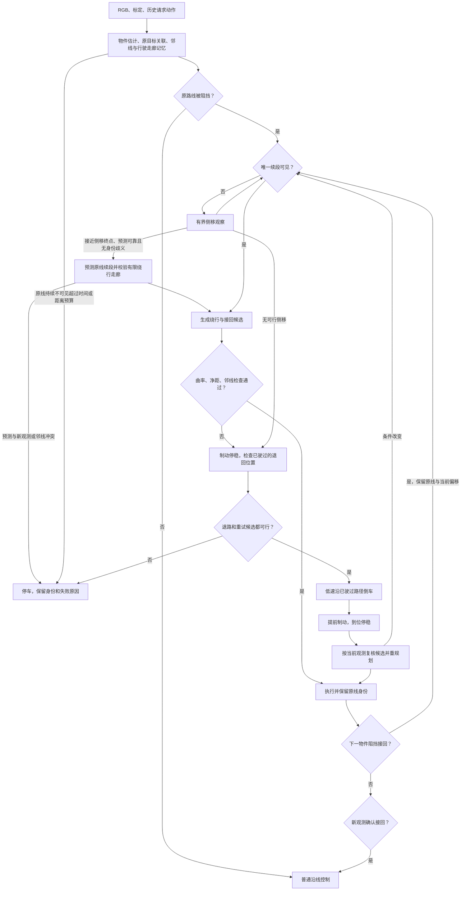

# 独立避障方案：原路线身份、局部绕行与倒车恢复

当前注册的 `temporal_pursuit_avoidance`、`temporal_mpc_avoidance` 为 **3.1**。两者使用相同的视觉感知、紧凑绕行、连续障碍物接续、有界原线预测和倒车恢复，前进控制器分别是 Pure Pursuit、采样式 MPC。普通 PP、MPC、扫描线和 CNN 仍是独立的沿线方法，没有在它们内部隐藏一个避障开关。各控制器的推导见 [算法设计](algorithms.md)。

## 1. 为什么连续障碍物不能简单地“向一侧打方向”

通过第一个障碍物之后，车辆往往还带着横向速度和接回转角。如果第二个物件很近，车到达它面前时已经没有足够纵向距离产生所需横向偏移。即使某条几何曲线看起来绕得过去，曲率也可能超过 `tan(max_steering_rad) / wheelbase_m`，或者车体在转向、制动响应期间先碰到物件。

临近路段让问题更困难：绕行偏移太大可能进入另一条目标路段或干扰线；朝最亮的空地一直转弯也可能永远找不回原线。因此恢复必须同时回答三个问题：

1. 哪条被遮挡的线是原目标，哪些是其他道路？
2. 从当前姿态能否形成满足曲率、净距与邻线隔离的路径？
3. 若不能，过去驶过的位置中是否有一个位置允许安全重试？

倒车只解决第三个问题中的空间不足，不能消除前两个问题。代码在没有可靠退路或路线证据时仍会保持停车。

## 2. 代码职责与一帧调用顺序

| 代码 | 职责 |
|---|---|
| [avoidance.py](../algorithms/avoidance.py) | 两个独立 SDK 入口，组合前进规划、控制器和恢复状态机；保存最终请求动作 |
| [obstacles.py](../algorithms/modular/obstacles.py) 中的 `ObstacleMemory` | RGB 物件检测、地面占用估计及短时记忆 |
| 同文件的 `ObstacleCamera`、`AvoidanceTracker` | 排除物件伪线，保持原线身份及邻线记忆 |
| 同文件的 `DetourPlanner` | 续段关联、有限侧移、绕行及接回候选，几何约束检查 |
| [prediction.py](../algorithms/modular/prediction.py) 中的 `RouteForecast` | 仅拟合真实观测，保存原线前缀，按误差、时间和距离限制外推 |
| [recovery.py](../algorithms/modular/recovery.py) | 已驶过路径记忆、退回位置选择、倒车控制、停稳后复核 |
| [control.py](../algorithms/modular/control.py) | 公共动作预测、PP 和 MPC |
| [dynamics.py](../pathlab/dynamics.py) | 仿真和算法预测共用的公开动力学方程 |

每帧先用最终历史指令更新自运动估计，再更新物件、路线和已驶过路径。随后读取当前图像；正常状态生成前进绕行路径，恢复状态则交给专用状态机。最后将本次实际请求写回 `last_action`，不能把被避障动作覆盖之前的普通沿线动作拿去预测下一帧。



## 3. 由 RGB 得到物件占用，而不是读取场景物件列表

### 3.1 为什么选择地面接触区域

`ObstacleMemory.observe()` 在 HSV 中提取有足够饱和度和亮度的非标记彩色区域，合并锥桶色带可能造成的上下断裂。平面终点色环与立体物件通过反投影跨度作区分。只有最下面的对齐色面用于估计地面接触，防止一只锥桶被算成多个前后排列的物件。

如果直接把锥桶顶部按地面单应矩阵反投影，距离会被大幅高估。代码因此向彩色面下方检查暗色底座，以底部边缘估计位置和投影宽度，形成带余量的圆形占用。它是单目近似，无法恢复任意物体的精确三维外形。

估计与附近已有物件融合后随自运动变换，保留中心、半径和观测年龄。一般保留 30 s、车后 3 m 内且距车 7 m 内的物件；正在处理的占道物件在原线参考释放前继续保留，避免倒车期间它因为离开画面而消失。部署只使用这些图像估计，不会读取 `Scene.objects`、`collidable` 或物件的真实坐标。因此视觉上相同但被教师设置为“不碰撞”的物件，策略仍可能绕开它。

### 3.2 看不完整的物件为什么仍要从道路图像中排除

原实现对被画面边缘裁切的物件直接跳过，连图像排除也一起跳过了。这样不能测距的半个锥桶及其黑底座会被地面骨架提取，当成一条向远处弯曲的道路。连续障碍物案例中，这会污染第一段绕行的接回参考，随后再影响第二个障碍物的规划。

当前先生成物件图像排除框，再判断是否足够完整、是否能够估计米制占用：**无法测距不等于可以把物件边缘当道路。** 裁切物件只排除图像，不凭空生成三维位置。相关行为由 `test_cropped_cone_is_masked_even_when_its_ground_contact_is_unknown` 回归测试覆盖。

避障版还要求候选暗线灰度低于局部背景的 55%，以排除箱子投下的较浅阴影边缘。物件区域用当前图像估计的地面灰度填充，避免固定亮白填充制造额外的对比边缘；因此本感知器仍依赖深色胶带与较亮地面的对比。已估计物件附近的小范围接地暗边也从鸟瞰道路掩膜与旧道路投影中排除。排除半径为估计占用半径再加 0.13 m，位于规划器禁止车中心进入的障碍物净距范围内；不会因删除这里的真实邻线而许可车辆开进这块区域。

## 4. 原线、邻线与绕行轨迹是三种不同数据

`DetourPlanner.reference` 保存原目标路线，`path` 保存临时绕行轨迹，`road_memory` 保存观测到的道路点，`target_memory` 帮助识别刚刚驶过且进入近端盲区的原线。`last_route` 保留最后一次确认的有序路段，接回第一段后遇到第二次遮挡时仍可判断占道；它不能单独使普通沿线控制器在 LOST 状态下开车。

绕行时车已经离开原线，所以“当前离车最近的暗线”尤其不可靠。`AvoidanceTracker` 持续用 `reference` 作为时序关联依据，不能让临时绕行轨迹变成下一次视觉寻迹的目标线。

重新进入视野的旧道路投影必须得到当前像素支持，否则删除，防止立体边缘投影随视角移动后留下多条幽灵道路。近端盲区中的邻线仍保留。判断其他道路时，剔除靠近原线和近期原线记忆的点，避免把自己刚驶过的曲线误认为邻线。

所有这些坐标都来自图像和自身动作积分。倒车也只是把同一份记忆按反向自运动更新，不把车辆真实位置回传给算法。

## 5. 从阻挡判断到有限侧移

`blockers()` 检查前方约 0.4–3.2 m 内的估计物件是否侵入原路线。因为物件排除框会让可见路线提前结束，末端可沿干净切向短暂延伸，仅用于判断“路线可能被物件遮断”。这种延伸不算已经确认的隐藏道路，不能直接用于接回。

`extend()` 才负责续段确认：以物件前干净路段估计切向，寻找物件后的候选，要求横向偏差小于 0.18 m、切向点积大于 0.85，并检查最佳和次佳候选是否明显不同。常规允许的缺口有限；经过侧移改善视角后上限可扩大到 2.5 m，但唯一性要求不变。

若还不能确认续段，`peek_path()` 生成一小段从当前车头方向出发、末端与原路切向一致的三次 Bézier 曲线：

```text
B(t) = (1−t)³ P0 + 3(1−t)²t P1 + 3(1−t)t² P2 + t³ P3
P0 = 当前后轴原点
P1 = 车头方向上的控制点
P3 = 有界侧移目标
P2 = P3 − 末端切向 × 末端控制长度
```

代码搜索侧移方向、长度、偏移量和两端控制长度，而不是只试一个固定转角。侧移路径必须已经通过曲率、全部已知物件净距和邻线检查；它的目的只是换观察位置，不能据此宣称遮挡后一定有路。

## 6. 完整绕行候选怎样构造与筛选

已确认路线按 0.05 m 弧长重采样并平滑，计算切向和法向。候选在原线上叠加横向位移，使用 `q(u)=u²(3−2u)` 平滑地增大和减小偏移，避免突变转向。左右方向、基础偏移档位和多种离开距离组成有限搜索。候选还根据物件相对原线的横向位置、估计半径及车宽动态补入偏移：偏在路线左侧的箱子，需要的左绕距离比居中箱子更大。这样避免固定的 0.75 m 不够、0.90 m 又超出走廊时漏掉中间的可行轨迹；最终仍须通过完整约束。

已经离开原线时，候选要考虑当前横向偏移和车头切向，升段加入初始切向修正，不能从“车仍在线上”的假设重新开始。已在一侧绕行时，无必要地跨线换侧会增加代价，但另一侧仍可在原侧不可行时成为候选。代码另搜索从当前原点和车头方向出发、与已观测原线切向相接的 Bézier 接回曲线。

`detour_cost()` 对离开和接回使用统一约束：

- 最大离散曲率不超过 `0.9 × tan(max_steering_rad) / wheelbase_m`；默认约 1.61 /m。
- 车中心距每个估计物件至少为 `物件半径 + 车宽/2 + 0.12 m`。
- 横向偏移受原路线附近走廊限制；走廊同时考虑物件相对原线的横向位置，避免偏置箱子的合法外绕被居中物件假设错误拒绝，算法上限仍不超过 1.0 m。平台的真实绕障区域与邻线检查独立生效。
- 对其他道路保留隔离距离；完整候选目标为 `min(0.32, 当前偏移 + 0.08) m`。若当前已靠近邻线，可沿路径逐渐增加到这个距离，但不能比当前位置更靠近邻线，也不能一直贴着邻线走；侧移观察另有从起点逐渐增加的门限。平台非法换线规则不变。

完整路径的邻线门限具体为 `min(0.32, 偏移+0.08, 起始邻线距离+0.25×已走弧长)`，在偏离原线且初始隔离不足时逐渐拉开距离；回到原线附近后按相应的小偏移门限检查。

未通过约束的候选直接拒绝，不能靠减小代价权重变成可行候选。通过后按横向偏移、离线面积与路径长度排序，曲率作为较小的平滑项；具体公式见下文。`planning_rejections` 提供 `visibility`、`curvature`、`obstacle`、`other_route` 等拒绝统计，方便区分“没看见”和“看见但转不过去”。

PP 避障版对有限侧移或保持偏移的接续路径末端沿切向延伸 0.7 m，仅供控制器选取前视目标，帮助车身提前对齐终端朝向；规划器的执行终点和停止条件不延长，原始输出路径也不包含这段虚拟引导。MPC 自行优化未来方向，不使用这项 PP 补偿。

侧移巡航请求为 0.25 m/s，完整绕行为 0.28 m/s。避障控制器的基础前视从 0.57 m 缩短为 0.34 m，仍叠加速度与惯性补偿。更短前视使控制器跟住紧凑弯道，更低速度给转角变化率和车身响应留出时间；普通沿线控制器保持原参数。算法使用圆形占用近似，平台最终以实际车体和物件轮廓做扫掠碰撞检测，两者并不等价。

### 紧凑候选如何避免过早、过远绕行

3.0 将起转位置固定在物件前约 1.8 m 再加估计半径处，且代价中的曲率平方直接对采样点求和，容易偏向长而平缓的绕行。3.1 搜索 0.90、1.15、1.40、1.80 m 的接近长度和 0.85、1.15、1.60 m 的接回长度，选择满足约束的紧凑候选。更晚起转不是一个固定的“距离障碍物多少厘米就打满方向”规则；轴距、最大转角、车宽、物件大小或当前姿态不允许时，短候选仍会被拒绝。

`compact_cost()` 使用米制积分：

```text
J = 0.7 × 最大横向偏移
  + ∫ |横向偏移| ds
  + 0.2 × (路径长度 − 起终点直线距离)
  + 0.015 × ∫ 曲率² ds
```

偏移积分同时惩罚离线过远和过早离线，曲率项只在可行候选中抑制无意义的弯折。积分用相邻采样点的实际距离加权，避免仅改变采样密度就改变偏好。有限侧移也改为最小化这类代价，并尝试保留一段直行前缀；旧实现最大化横向偏移和侧移长度的选择方式已移除。侧移与完整绕行统一采用 `估计物件半径 + 车宽/2 + 0.12 m` 的几何净距；实际车体碰撞仍由平台独立检查。

### 连续障碍物：什么时候接续，什么时候停车

`command_path()` 每帧检查已承诺的临时路径。新观测物件侵入这条路径时，旧候选立即失效；重新规划仍使用原目标线作为参考，候选必须同时避开全部已知物件，不能为了绕下一个物件而撞回前一个。

若第一物件已在车后 0.4 m 以外，原线前方又检测到占道物件，则从车辆**当前偏移和朝向**直接规划下一段，不等待 `rejoin_observed`。这里保留“先充分越过第一物件”的条件，避免车体尚在绕第一物件时过早切换。对于同一视野中已确认、相邻弧长间隔不超过 2 m 的多个阻挡，候选将安全侧移维持到最后一个物件之后再接回；不在每个物件中心之间强行回线。`detour_handoffs` 记录接续次数，`planned_obstacles` 记录本次完整候选考虑的连续阻挡数。

接续不重置原路线身份，也不重置不可见预算。没有可用预测时保留 6 s / 1.5 m 的观测预算；**只有规划已接受原线预测、模型仍有效且没有预测冲突时**，才放宽到 20 s / 4.5 m。任一上限触发就制动；这不是承诺能盲行到上限，曲率、邻线、已知物件和路径终点会更早否决继续行驶。预算只影响两个避障入口，普通沿线方法仍保持原有丢线规则。

`route_unseen_s` 的计时独立于普通跟踪器，因此歧义状态也会消耗预算。只有当前目标关联成功，或 `extend()` 从当前像素找到唯一且切向一致的续段，才刷新它；重用缓存路线、换一个障碍物、重规划、取出预测曲线都不算新观测。路线观测预算和预测模型自身的年龄 / 行驶距离分别管理；一次不足以拟合可靠几何的短观测不能把预测模型续期。

### 遮挡时怎样预测原路线，再用新画面接回

`RouteForecast` 的输入只有已关联的有序视觉路径和图像估计物件。它不访问地图文件、模拟器位姿或评分器。完整流程如下：

1. **先保存真实支持。** 每次成功关联后，排除物件接触边附近的点，从末端连续干净路径取最多 1.4 m、至少 0.7 m 的窗口。按弧长重采样，对二维位置作二次拟合。若整段直线拟合的均方根误差小于 0.012 m，优先采用直线，避免把像素台阶放大成虚假的长弯道。拟合还检查残差、切向速度和曲率；质量不足时不刷新旧模型。
2. **保存前缀，仅预测末端。** 拟合窗口只估计末端位置、方向和曲率，窗口之前已观察到的弯道仍完整保留。外推用常曲率圆弧，零曲率自然退化为直线。每帧随公开动作里程计变换，累计模型年龄与实际估计行驶距离；预测点绝不反过来作为训练样本。
3. **让误差随外推长度增长。** 设拟合残差为 `r`、窗口长度为 `L`，当前启发式误差界为 `u(s)=0.02+3r+(0.012+2r/L)s+(0.004+2r/L²)s²`，单位为米。外推最多 4.5 m，要求 `u(s)<0.28 m`、累计方向变化小于 0.7 rad、模型年龄小于 20 s 且累计行驶小于 4.5 m。这是保守几何门限，**不是经过统计校准的置信区间**。
4. **优先使用新观测。** 已有可用的视觉续段优先；已有侧移也先执行，在终点附近或短时观测预算耗尽时尝试预测接续；后一种情况先清除旧候选，重新验证路径，不能只延长旧路径的执行时间。当前规划只接受末端曲率绝对值不超过 0.12 /m 的直线或缓弯外推。隐藏急弯的走向不能仅由一小段直线确定。多个视觉候选难以区分时不靠预测强行选一个；新观测与预测不一致，或预测误差走廊碰到其他道路时也拒绝。与预测同向、近乎重合的地面线可作为兼容支持，但不能单独刷新模型寿命或证明已接回。
5. **从当前偏移继续规划。** 被接受的预测进入同一套曲率、物件净距和邻线检查，预测参考下的横向走廊额外限制为最多 0.8 m；延长观测间隔不意味着允许更宽的盲目侧移。若看得足够远，规划完整绕行；若只有有限走廊可行，可以保持当前一侧的安全偏移向前，接近末端后滚动规划，不要求在两个物件之间先回线。完整可行接回优先于这类保持偏移候选，仍不能驶过未经验证的路径终点。
6. **重新看见原线后校正。** 当前视觉路径与原线参考匹配后，替换预测续段，撤销旧预测返回路径，从当前姿态重新规划。物件已越过、车距原线小于 0.12 m，且新画面确认身份时才退出避障。预测过期、存在冲突或后续路径不可行，就请求制动；仅有预测参考而无可行前进路径时，不再用倒车反复尝试扩大盲行走廊。倒车恢复保留给有视觉路线依据的规划失败；不能把旧预测重复使用当作新的视觉证据。

调试输出中的 `route_prediction` 表示正在使用预测参考，`prediction_available` 表示拟合模型自身仍有效；两者含义不同。`prediction_rejection`、`prediction_age_s`、`prediction_error_2m` 可解释为什么当前不能外推；`detour_continuing` 表示有限保持偏移的接续候选。预测模块不引入额外安装依赖。

允许尚未回线就处理下一个障碍物，不代表允许根据一段越来越旧的路线记忆无限向侧面行驶。倒车是前进候选不可行、且视觉预算仍有效时的后备恢复能力。

## 7. 倒车恢复逐步执行什么

实现为 [ReverseRecovery](../algorithms/modular/recovery.py)，只由两个独立避障入口使用。

### 7.1 触发之前：必须已经有原路线和退路

前进规划持续约 0.25 s 不可行后才考虑恢复，避免一次短暂图像抖动就反复换向。场景必须允许倒车，目标身份已经初始化，且存在已确认的占道物件。若前一段绕行未接回、第二个物件已挡在前方，会把这次恢复绑定到前方占道物件，同时保留原路线。

`advance()` 按历史请求动作的积分，约每 0.025 m 保存一个车体位置与朝向，保留最近约 4 m 的已驶过走廊。这不是全局地图，也没有后摄像头。没有走过的后方区域不能被纳入倒车候选。

### 7.2 `brake_before`：先把前进惯性刹停

恢复先请求零速，并保留当前前轮转角。只有估计速度到零，才选择倒车位置。系统本身也有正负换向的制动互锁，因此手动直接从正速度拉到负速度也不会瞬间反转速度向量。

### 7.3 `_choose_retreat()`：退多少由可行性决定

按从短到长的顺序检查约 0.45、0.75、1.05、1.35、1.60 m 的历史位置。实际采样位置来自离散的已驶过轨迹，因此日志中的距离可能略有不同。

对每个候选同时检查：

1. 从当前位置到该历史位置的整段后退路径确实有记录，并与当前已知物件保持净距。
2. 将原线、邻线、物件及当前观测变换到候选姿态，运行同一个前进规划器。
3. 优先选择能够生成完整绕行或已通过几何检查的有限侧移路径的位置。虚拟检查无法看到后退后才露出的地面，因此还允许受限的恢复视野候选：倒车走廊必须安全，物件处于该姿态的前方视角内，纵向余量至少达到双圆弧侧移所需的几何空间。

优先选择最短的已验证候选；若没有这样的候选，才选择上述恢复视野位置。对曲率半径 R 和所需侧移 d，双圆弧纵向长度为 `sqrt(4Rd−d²)`，代码再加物件半径、半车长和余量。这个检查只是恢复空间的条件，不证明遮挡后的道路可通行。虚拟检查只使用公开历史和预测，不读取该虚拟位置处的模拟器图像；退回后必须用新图像验证前进方案，仍不可行就按预算停车。

### 7.4 `retreat`：沿已驶过路径低速倒车

专用后向跟踪器从历史路径中选择约 0.38 m 的后方前视点，用 `atan(wheelbase × 2y/(x²+y²))` 计算前轮角度，请求速度为 `−min(0.28, max_reverse_speed_mps)`。

这里不能简单把普通 PP 的速度改成负数：普通 PP 只选择 `x>0` 的目标点，而后向跟踪必须沿反向排序的已驶过路径选点。动力学用带符号速度计算车身角速度，前轮左打在倒车时使车身航向向右变化。

倒车期间持续检查已知物件净距和对历史路径的偏离。新增阻挡或无法维持走廊时立即请求制动。历史路径被退回后裁掉已撤销的前进部分，避免下一次恢复沿一条带回环的历史数组抄近路。

### 7.5 `brake_after`：提前刹车，到位停稳

每帧从当前估计的速度、转角、加速度和角速度出发，用同一公开动力学积分零速指令，预测完整停止距离。剩余后退距离达到该停止距离附近就请求制动，而不是到了几何终点才发现仍有后退惯性。

用户界面中的“停车”意味着立即发出制动指令，实际速度仍按惯性降到零。不能通过直接清零速度来制造一次看似成功的恢复。

### 7.6 停稳后：复核原候选，再决定是否前进

若选择退回位置时已经有可行前进候选，则保存候选及原线参考；恢复视野类型没有这样的候选，必须停稳后重新规划。停稳后，实际姿态与候选起点需足够接近（位置 0.10 m、切向约 0.16 rad 的容差），并按当前物件和邻线观测重新检查曲率、净距与隔离。

复核通过才重新执行候选；若条件改变，则保留原线重新规划。新出现的物件可以否决倒车前选好的路径，不能因为已经付出倒车成本就继续执行旧方案。`test_new_obstacle_can_veto_a_forward_plan_after_reverse_braking` 覆盖这一行为。

同一个物件最多两次恢复尝试，一次恢复最多约 18 s；预算耗尽或无可行退路时进入 `failed` 并保持制动，不能无限前进、后退循环。`recovery_stage`、`recovery_reason`、`reverse_target_m`、`reverse_recoveries` 随算法输出记录。

## 8. 怎样确认接回，而不是接到隔壁路线

临时路径结束不代表绕行完成。退出条件包括：物件已在车后、车辆已靠近原路线，而且当前新图像与记忆中的原路线续段吻合。仅有预测路径不能提供“接回已确认”的证据。

即使恢复状态机认为自己正在正确绕行，平台仍独立检查起点门、有序路段、实际碰撞和邻线。评分器 5.0 把当前参考弧长与最远完成进度分开：后退可以沿原路减少当前弧长，已记完成量不减少也不重复增加。逆向进入旁边道路仍是非法换线。详细指标见 [evaluation.md](evaluation.md)。

## 9. 配置、运行和复现

新场景默认允许倒车，上限 0.5 m/s。旧地图明确保存 `reverse_allowed=false` 时保留其设置；在主页「车辆惯性与制动」勾选「允许倒车」、设置最高倒车速度、应用后另存，即可在单次或批量测试中使用。

手动驾驶的目标速度滑条支持负数，向下键可减速到负数，空格请求制动。界面显示前进 / 倒车 / 制动目标，实际速度向量仍由动力学决定。

快速评测可以显式冻结同一组地图的倒车许可：

```bash
python scripts/evaluate_algorithms.py --algorithms temporal_pursuit_avoidance temporal_mpc_avoidance --scene-files scenarios/challenges/block-double.json scenarios/challenges/user-close-obstacles.json --reverse on --steps 1800 --jobs 2 --output artifacts/evaluation-reverse
```

用 `--reverse off` 可做同一算法的能力消融；省略时保留地图原设置。使用不同输出目录，比较完成量、碰撞、非法换线、耗时和实际倒车距离。这个开关只限制车辆能力，不会把普通沿线方法变成避障方法。

## 10. 评测范围与已知限制

### 3.1 紧凑绕行、接续规划与原线预测

本次参考的人工记录为 `1d0cb0e1cccf4c2095b48d6dc7c347fa`，旧 MPC 记录为 `312e6517009942409e3977cce02044f1`。两者与 `block-double.json` 的道路、物件和车辆动力学一致；显示名称不同，固定输入的倒车开关在运行时显式开启。人工记录在约 24% 进度主动结束，因此只用于比较前两个物件的局部轨迹，不作为完整任务成功证明。

在起点后前 8 m 内，以后轴横向偏移第一次超过 0.05 m 定义“明显开始侧移”：人工约在 x=2.04 m，旧 MPC 为 x=0.83 m，3.1 版约为 x=1.75–1.78 m。第一物件位于 x=3.5 m，因此新版保留了更长的沿线直行段。第一处峰值偏移约 0.60 m，第二处约 0.80–0.81 m；后者仍大于人工约 0.62 m 的峰值，单目占用近似与控制余量仍有代价，不能声称已完全复制人工轨迹。

离线面积按 `∫ |横向偏移| ds` 统计实际行驶轨迹，包含倒车经过的距离。前 8 m 内，新版约为 2.8 m²，旧 MPC 约为 4.25 m²，降低约 34%。该指标只用于这段同几何直路的行为对照，不替代完整地图的成功率或碰撞指标。

| 当前回归集合 | PP + 避障 | MPC + 避障 |
|---|---|---|
| 五张主要绕障图 | 5/5，均无倒车 | 5/5，均无倒车 |
| `user-0920.json` | 成功 | 成功 |
| `user-0920-obstacles.json` | 停车超时，约 16.7% | 停车超时，约 16.7% |
| 新增 `block-chain-occluded.json` | 停车超时，约 10.7% | 停车超时，约 9.7% |
| 合计 | 6/8 | 6/8 |

16 回合均无碰撞、无非法换线。新增三障图纳入分母，失败仍保留；原有七张图仍各通过六张。三障图中 PP 的预测参考被启用，但箱体占用估计、净距与预测走廊约束未能产生可持续执行的绕行，不能把“预测已启用”写成成功。两种方法在连续占道图上的真实 JSONL Worker 运行也均成功、无需倒车且最终实际速度为零。

最终逐回合结果、原文件与代码哈希、人工 / 旧版对照及 Worker 记录见 [compact-detour-results.json](compact-detour-results.json)。这些仍是开发回归结果；紧密遮挡导致停车的案例继续计为任务失败。预测接续的几何可行性、保持偏移、邻线拒绝、有限终点制动及真实 RGB 接回另有专项测试覆盖，不能用这些局部测试替代完整地图成功率。

### 3.0 倒车能力的历史回归

历史 2.0 在六张开发图中，两种避障方法各成功 4/6；连续占道图均停车超时，额外镜像图只有 PP 通过。历史完整摘要保留在 [algorithm-results.json](algorithm-results.json)，评分版本 4.0；不能与当前 5.0 结果直接混排总分。

2026-09-21 的 3.0 版回归使用 640×360 RGB、地图原有惯性参数、每回合 1800 帧（90 s）任务预算，显式开启倒车，评分器为 5.0。下表中的百分比是最远完成进度；到达平台原有终点容差即成功，不要求数值恰好为 100%。

| 固定地图文件 | PP + 避障 | MPC + 避障 | 实际倒车次数（PP / MPC） |
|---|---|---|---|
| `block-double.json`：连续占道 | 成功，99.5% | 成功，99.5% | 1 / 1 |
| `user-close-obstacles.json`：近距平行干扰(1) | 成功，99.5% | 成功，99.5% | 1 / 1 |
| `block-coil.json`：套圈占道 | 成功，99.5% | 成功，99.5% | 0 / 0 |
| `block-neighbor.json`：占道与邻线 | 成功，99.4% | 成功，99.4% | 0 / 0 |
| `user-0920-obstacles.json`：旧 0920 含障碍 | 超时，16.7% | 超时，16.7% | 0 / 0 |
| `mirror-close-obstacles.json`：近距平行干扰镜像 | 成功，99.5% | 成功，99.5% | 1 / 1 |
| `user-0920.json`：0920 原线 | 成功，99.5% | 成功，99.4% | 0 / 0 |

两种方法各 **6/7 成功**，全部 14 个回合均无碰撞、无非法换线。地图位于 [scenarios/challenges](../scenarios/challenges)，种子保持为地图内的 920、7、10029。这些图参与过开发或回归，包括复用的镜像图，不能称为未见测试集，也不能由 6/7 推算任意地图的成功率。

连续占道图另做了同代码、同评分器的倒车开关消融：关闭时，两个方法均在约 17.6% 进度停车超时；开启时，PP 在 72.25 s 完成，实际后退 1.379 m，MPC 在 71.60 s 完成，实际后退 1.365 m。两者各一次倒车，因此改善不只是代码里出现了负速度分支，而是在这张图上改变了完整任务结果。

同一连续占道案例再通过真实 JSONL Worker 独立进程运行，两种方法均成功，最终实际速度为零，未出现协议异常或超时；完成帧数与进程内回归一致。该验证允许每次请求 1 s 超时，并在并发 CPU 负载下测量，不能据此声称满足 20 Hz 实时预算。完整代码哈希、地图原文件及规范化配置哈希、逐回合指标、倒车关闭对照和 Worker 结果保存在约 30 KB 的 [reverse-results.json](reverse-results.json)，其中附有复现命令。

仍失败的旧 0920 含障碍图属于另一类问题：结束帧为 `LOST`，诊断是“目标关联门限未通过，停车保留身份”，没有可用的估计占道物件，因此也没有触发倒车。日志支持“感知 / 路线关联链路未恢复”，不能将其解释为已经证明道路几何不可通行。倒车恢复不是任意丢线状态下盲目后退的替代品，这个案例继续作为已知失败保留。

这仍是彩色物件、静态平面场地中的单目局部规划方案。灰色、低对比、与提示同色的物件可能漏检；动态障碍物可能进入前摄像头看不到的后方；动作延迟和滑移会使纯指令里程计漂移。倒车只在短时已驶过走廊内恢复，没有提供后向实时感知、全局搜索或任意地图保证。无可行走廊时停止是有意的失败方式，不能记成绕行成功。
