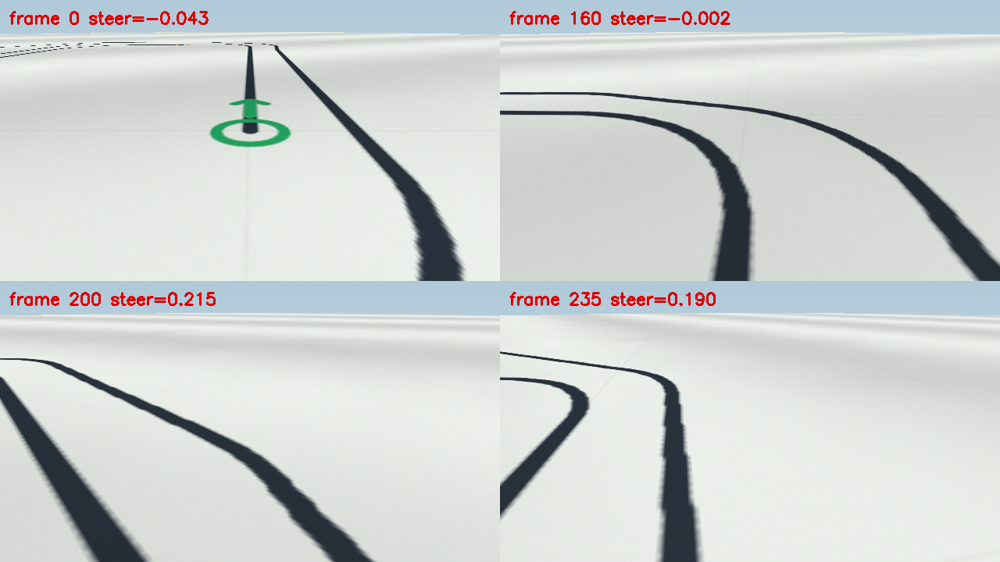

# 复杂自定义地图：学习策略的复现与修正

本轮开发同时保存了两份不同的地图，不能混为一个测试案例：

| 案例 | 来源 | 相机俯角 | 车辆模型 | 用途 |
| --- | --- | --- | --- | --- |
| 原始保存图 | `artifacts/maps/486c1f986a8f4a4abd2d4e7a2c3018a2.json`，18 个控制点 | 0.52 rad | `kinematic_v1` | 用户提供的开发回归案例 |
| 实际失败图 | `artifacts/runs/052fbbf6485b4ccab11b7a5f44424053/manifest.json` 内的 scene，20 个控制点 | 0.38 rad | `inertial_v2` | 用户真实失败的开发回归案例 |

两者的路线几何也不同。旧模型在原始保存图上能完成；实际失败图第一次左转处出现约 0.4 m 间隔的并行弯线，旧惯性模型把外侧的后续路段混入转向决策，随后离开应当依次经过的目标路段。用新版有序评测器重跑，该失败仍被完整记录为非法换段，进度约 14%。历史帧中的网络权重 SHA-256 为 `09e31baca684b4046e416765a314085aea2bb1c74086d4aa55814ebd4609ffdb`。



## 原因与修改

旧训练集包含直线平行干扰和较疏的往返线，缺少密集套圈以及平行弯线。转弯处的画面不属于它充分训练过的分布。隐藏状态训练窗口仅 1.2 秒，且所有窗口统一丢弃最前两帧损失，真实回合开始的动作和可见性也被丢弃。实际失败记录第一帧明明有完整绿色标记，旧模型却输出 LOST，可见性仅约 0.07。

本轮保留 401,259 参数的 CNN + GRU 直接动作架构，修正训练和数据覆盖：

- 真实回合的第一帧立即接受动作与可见性监督；只有从中间截取的训练窗口预热两帧。
- 时序训练窗口增至 24 帧，即 2.4 秒。
- 版本化的 `rgb_marker_v2` 输入在第四通道显式呈现公开绿色标记。它只是 RGB 的颜色提示，既不拟合道路，也不产生控制动作；旧权重继续使用原始预处理。
- 两份用户地图明确归入开发集，加入镜像、尺度、初始偏差、相机和动力学变化。
- 新增独立生成的套圈与平行 S 弯；随机几何种子 0–99 用于开发，201–204 用于验证，6001–6003 保留为最终测试。
- 同时覆盖旧/新车辆模型，原生 320×180 和 640×360 渲染链，以及摄像头、光照、线宽、执行器响应、离线扰动和路旁物件。
- 真实闭环 DAgger 采集学生走偏后的状态，并由仅存在于训练程序的有序路线专家提供恢复监督。
- 另采集短程起步场景，覆盖双侧相邻线、初始侧偏和航向偏差；起步损失同时作用于转角、速度和可见性，避免长直线帧淹没接入学习。

部署仍只读取图像、公开提示、过去动作和公开车辆限制，网络直接输出转角及速度。没有读取地图 ID、种子、私有位置、路线或评测器，没有几何专家回退。离线训练程序读取真值是监督学习所需，不被部署模块导入。

## 数据和复现

首轮新数据是 48 条完整专家轨迹、23,507 帧；用户案例全部是开发数据，新增验证轨迹使用独立随机几何。每条轨迹的完整场景、原始文件散列、教师、物理/渲染版本均写入 manifest。

```bash
python -m algorithms.learning.custom_data \
  --data artifacts/learning/complex-data \
  --scene-files artifacts/maps/486c1f986a8f4a4abd2d4e7a2c3018a2.json \
    artifacts/runs/052fbbf6485b4ccab11b7a5f44424053/manifest.json \
  --source-episodes 6 --generated-episodes 4 --jobs 8

python -m algorithms.learning.train fit \
  --data artifacts/learning/data artifacts/learning/inertial-data artifacts/learning/complex-data \
  --resume algorithms/learning/weights/driver.pt \
  --output artifacts/learning/complex-bc.pt \
  --epochs 10 --sequence-length 24 --batch-size 24 --threads 4 \
  --lr 0.00015 --acquisition-weight 3 --acquisition-targets steering --save-every 2
```

接着采集旧策略纠偏与短起步轨迹，并训练显式标记版本：

```bash
python -m algorithms.learning.custom_data \
  --data artifacts/learning/complex-dagger-old \
  --scene-files artifacts/maps/486c1f986a8f4a4abd2d4e7a2c3018a2.json \
    artifacts/runs/052fbbf6485b4ccab11b7a5f44424053/manifest.json \
  --source-episodes 2 --generated-episodes 2 --checkpoint legacy --beta 0.45 --jobs 6

python -m algorithms.learning.custom_data \
  --data artifacts/learning/acquisition-complex-data \
  --kinds acquisition --generated-episodes 24 --jobs 8

python -m algorithms.learning.train fit \
  --data artifacts/learning/data artifacts/learning/inertial-data \
    artifacts/learning/complex-data artifacts/learning/complex-dagger-old \
    artifacts/learning/acquisition-complex-data \
  --resume artifacts/learning/complex-bc-epoch2.pt \
  --output artifacts/learning/complex-marker.pt \
  --epochs 6 --sequence-length 24 --batch-size 24 --threads 4 \
  --lr 0.00012 --acquisition-weight 4 --acquisition-targets all \
  --input-version rgb_marker_v2 --save-every 2
```

最初采集 DAgger 时 `auto` 选择当时的两个历史模型；如今默认已更新，复现须使用 `legacy` 保持原策略。两份原始来源文件也可替换为 [冻结场景](../artifacts/algorithms/custom-final/scenes) 下的 `user-original.json` 和 `user-actual.json`；几何相同，来源元数据和文件名散列会相应变化。历史基础数据的来源见 [历史模型卡](../algorithms/learning/weights/MODEL_CARD.md) 和 [惯性模型卡](../algorithms/learning/weights/INERTIAL_MODEL_CARD.md)。

## 发布选择与结果

第二阶段包含 252 条轨迹、67,014 帧，训练 / 离线验证分别为 200 / 52 条和 53,048 / 13,966 帧。阶段一实际训练 10 轮，阶段二 6 轮。发布的是阶段二第 2 轮固定快照，不是训练主文件后续按最低离线损失保留的版本。

| 固定验证集合上的候选 | 成功 / 20 |
|---|---:|
| 几何扩充，第 1 轮 | 14/20 |
| 几何扩充，第 4 轮 | 17/20 |
| 几何扩充，第 6 轮 | 16/20 |
| 显式标记 + DAgger，第 1 轮 | 18/20 |
| 显式标记 + DAgger，第 2 轮（发布） | 20/20 |

选择规则为首个通过固定 20 个独立验证场景和两个用户开发案例的模型，之后冻结并进入保留测试。首轮显式标记的报告额外包含两份用户图的外观变化，其 20/22 不能写成独立验证 20/20；上表正确扣除了这两个开发案例。

发布文件 `driver-complex.pt` 的 SHA-256 是 `d87a1d6e0c16823b5ac2b559aa96b827f5eabd868f779aaf0ae035b555574999`。两份用户原始配置回归 2/2；保留测试默认八类 8/8、复杂几何 7/8，总计 15/16。剩余的平行弯线末段误切被保留在 [完整结果](custom-map-results.md)。旧权重保持原文件，显式指定 `checkpoint` 仍可运行。

实际计划、逐轮日志、逐文件数据散列和权重选择记录均随 [模型卡](../algorithms/learning/weights/COMPLEX_MODEL_CARD.md) 提供。复现两个阶段时保留原总轮数，因为余弦学习率调度依赖它；训练后取指定快照进行闭环验证。

不要用用户案例的完成率代表未见地图的泛化能力。相同几何的镜像、相机变化和重复轨迹也不能算作独立测试地图。旧权重和历史评测保留供显式复现；新版评分不能与旧评测器的分数直接比较。

模型的可见性头不等于目标身份置信度；学习策略也没有通用避障能力。物件若封堵唯一目标线，应当记录失败，不能绕过碰撞扣分或以另一条线代替目标路线。有限的仿真闭环测试不能保证任意复杂地图、任意遮挡或真实交通环境的可靠性。
